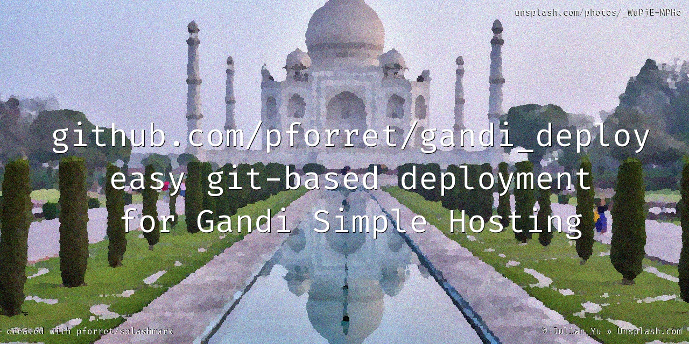

# gandi_deploy


* script to work easily with gandi.net paas git deployment (bash)

## Installation
    
### prerequisites

* make sure [Gandi CLI](https://cli.gandi.net/) is installed correctly

        # test with
        gandi account info

### easy install

* With [basher](https://github.com/basherpm/basher) package manager

        basher install pforret/gandi-deploy

### manual install
* clone this repository somewhere on your machine

	`git clone https://github.com/pforret/gandi_deploy.git`

* from any of your Gandi git-managed project, add a symbolic link to gdeploy.sh

	`ln -s /path/to/gandi_deploy/gdeploy.sh .`

### in any 'deploy with git' www.example.com folder

* run gdeploy.sh init

	`./gdeploy.sh init`

* to preview your site on your local server

	`./gdeploy.sh serve` (on port 8000)
	
	`./gdeploy.sh rnd` (on a random port between 8000 and 8099)

* to publish your site, run this to commit, push and deploy

	`./gdeploy.sh all`

## Usage 

```
# gdeploy 1.3.0
# author: Peter Forret <peter@forret.com>
# website: https://github.com/pforret/gandi_deploy
> usage: gdeploy [init|commit|push|deploy|all|login|serve|domains] (target)
init        : initialize the Gandi Paas settings
all [remote]: commit, push and deploy this website
commit      : git commit all local changes
push [rem]  : git push to Gandi git server
pull [rem]  : git pull from Gandi git server
deploy [rem]: ssh deploy from git to live website
login       : do ssh login to the Gandi host for this website
serve       : run local devl website on localhost:8000
rnd         : run local devl website on random port localhost:8000-8099
consoles    : get 'gandi paas console ...' command for every domain
domains     : get all hosted Gandi sites
```
