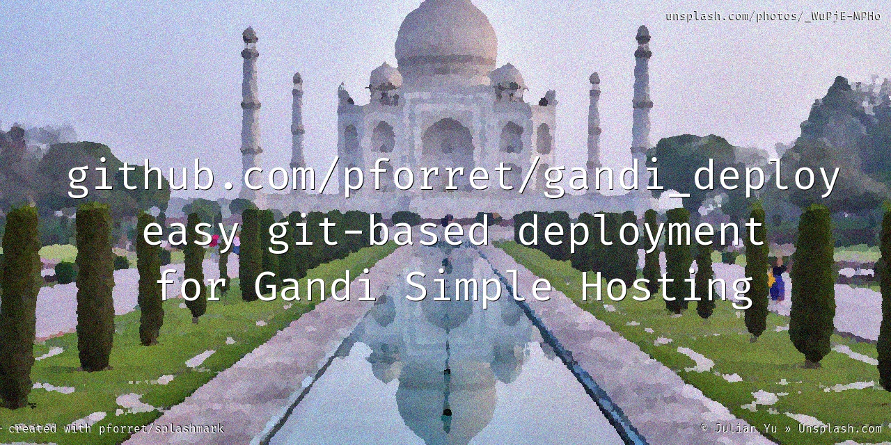

# gandi_deploy

* script to work easily with gandi.net paas git deployment (bash)

## Installation
    
### prerequisites

* make sure [Gandi CLI](https://cli.gandi.net/) is installed correctly

        # test with
        gandi account info

### easy install

* With [basher](https://github.com/basherpm/basher) package manager

        basher install pforret/gandi-deploy

### manual install
* clone this repository somewhere on your machine

	`git clone https://github.com/pforret/gandi_deploy.git`

* from any of your Gandi git-managed project, add a symbolic link to gdeploy.sh

	`ln -s /path/to/gandi_deploy/gdeploy.sh .`

### in any 'deploy with git' www.example.com folder

* run gdeploy.sh init

	`./gdeploy.sh init`

* to preview your site on your local server

	`./gdeploy.sh serve` (on port 8000)
	
	`./gdeploy.sh rnd` (on a random port between 8000 and 8099)

* to publish your site, run this to commit, push and deploy

	`./gdeploy.sh all`

## Usage 

    ./gdeploy.sh [init|commit|push|deploy|all|login|serve|rnd|domains]

* **init** : will get all server/domain/git/remote info for use with the other commands - to update it, just run it again

* **commit** : git commit all local changes (will ask for commit text)

* **push [remote]** : git push to Gandi git server (very fast)

* **deploy [remote]** : ssh deploy from git to live website (slow if you have a lot of files or composer packages)

* **all [remote]** : commit, push and deploy this website

* **login** : do ssh login to the Gandi host for this website

* **serve** : run local devl website on localhost:8000

* **rnd** : run local devl website on random port localhost:8000-8099, and open it in a browser 

* **domains** : list all hosted Gandi sites, per Simple Hosting server

* **consoles** : get 'gandi paas console ...' command for every site hosted

